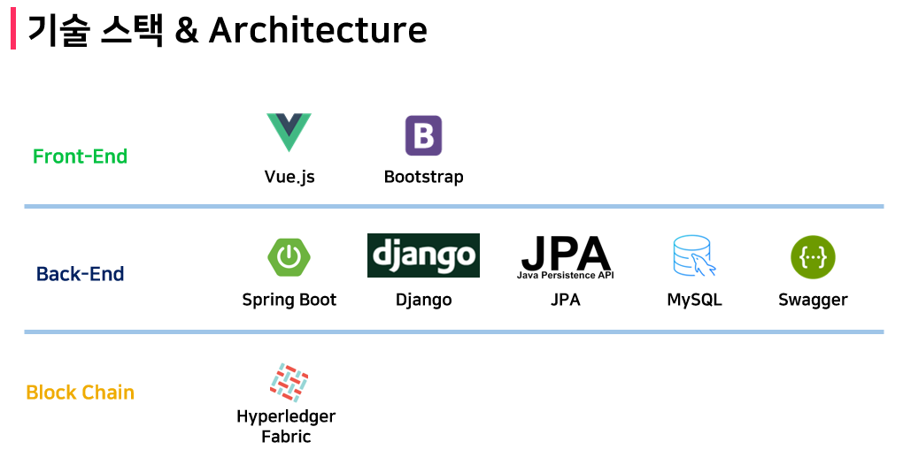
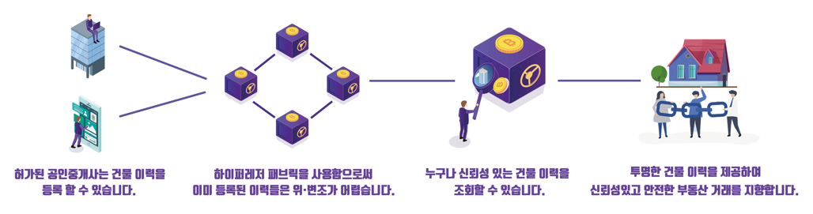
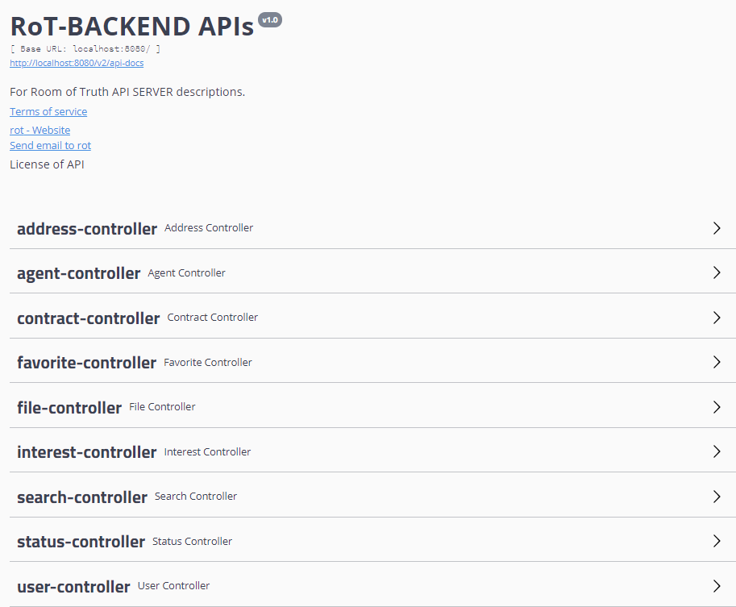

<br/>

<center><center>
<br/>

<br/>

<center><center><br/>

<center><center>

<br/>

<br/>

|  |  |
| --------------------------------------------------------- | -------------------------------------------------------- |
|     |  |


------

<br/>


<br/>

- **KAKAO 로그인**: ***OAuth2.0***과 ***JWT***를 사용하여 간편하지만 안전한 로그인 기능을 제공합니다.
- **Hyperledger Fabric**을 이용한 **부동산 분산원장 플랫폼**
- **부동산 이력** (매매, 전세, 월세, 임대) 및 **유지보수이력** (시설, 환경, 유지) 관리
- **검색어 자동완성** 및 **최근 검색어** 서비스 제공
- **KAKAO MAP**을 활용한 위치 기반 서비스 제공
- 공인중개사들의 **실시간 랭킹** 정보 제공
- **실거래가 데이터** 활용 시세변경 추이 제공
- 실제 데이터 기반 건물 주변정보 **시각화 제공**

<br/>

<br/>

<center></center>
<br/>

<center><center>
<br/>

<br/>

<br/>

<center><center>
<br/>
<br/>

| Controller   | Feature                                                      |
| ------------ | ------------------------------------------------------------ |
| **address**  | **📘 주소검색**                                               |
| **agent**    | **📗 공인중개사 등록<br/>📗 공인중개사 조회<br/>📘 공인중개사 이력 조회<br/>📘 공인중개사 상세 조회<br/>📘 랭킹 가져오기** |
| **contract** | **📗 건물 이력 조회<br/>📗 이력 상세 조회<br/>📗 군집(지도) 이력 List 조회<br/>📗 이력 등록<br/>📘 시군구(지도) 모든 이력 조회<br/>📘 이력 작성 시 공인중개사 번호 조회** |
| **favorite** | **📗 찜하기<br/>📙 찜하기 취소<br/>📘 찜한 이력 조회<br/>📘 찜한 점수 조회** |
| **file**     | **📗 파일 업로드**                                            |
| **interest** | **📒 유저 관심정보 수정<br/>📘 ID로 유저 관심정보 조회**       |
| **search**   | **📗 검색 기록 추가<br/>📙 검색 기록 삭제<br/>📙 ID로 검색 기록 조회** |
| **status**   | **📗 유지보수 이력 저장**                                     |
| **user**     | **📗 새로운 유저 정보 저장<br/>📘 ID로 유저 정보 찾기<br/>📗 카카오 로그인<br/>📗 토큰 검증** |

<br/>

<br/>

## **:chains:** 부동산 및 유지보수 이력 Chaincode

```javascript
var ContractRecord = {
    contract_id: args[0],				// PK
    around_around_id: args[1],			 // address Key
    exclusive: args[2],					// 전용면적
    floor: args[3],						// 층
    ho: args[4],						// 호
    kind: args[5], 						// 건물 유형
    detail: args[6],					// 거래 내용
    cost: args[7],						// 비용
    monthly: args[8],					// 월세
    license: args[9],					// 공인중개사
    image: args[10],					// 이미지
    contract_date: args[11],			 // 계약 일시
    created_at: timestampString,		 // 원장 저장 일시
    is_expired: args[12]				// 만료 날짜
};
```

<br/>

```javascript
var StatusRecord = {
    status_id: args[0], 				// 유지보수 이력 num
    around_around_id: args[1],			 // address Key
    floor: args[2],						// 층
    ho: args[3],						// 호
    category: args[4]					// 유지보수 내용 [시설, 환경, 유지]
    detail: args[5],					// 상세 내용    
    cost: args[6],						// 비용
    license: args[7],					// 공인중개사
    image: args[8], 					// 이미지
    start_date: args[9],				// 시작 날짜
    end_date: args[10],					// 종료 날짜
    created_at: timestampString,	 	// 등록 일시
    is_expired: args[11]				// 만료 일시
};

```

<br/>

<br/>

<br/>

## 🏃 Quick Start

### **Front-end (Vue)**

:one:  **npm install** 명령어를 실행시켜 주세요.

:two:  **npm run serve** 명령어를 실행시켜 주세요.

:three: ​ **index.js** baseUrl을 http://localhost:8080/ 으로 설정해주세요.

<br/>

<br/>

### **Back-end (Springboot)**

:one:  https://projectlombok.org/download **lombok**을 다운로드 후, dependency를 추가해주세요.

```java
    <dependency>
        <groupId>org.projectlombok</groupId>
        <artifactId>lombok</artifactId>
        <scope>provided</scope>
    </dependency>

```

 :two: **com.roomoftruth.rot** 경로에 있는 **RotApplication**을 실행시켜주세요.

<br/>

<br/>

### Back-end (Django)

##### :one: 프로젝트에 사용되는 라이브러리들을 설치

```
$ pip install -r requirements.txt
```

##### :two: ​데이터베이스 설정

```
$ python manage.py migrate
```

##### :three: 프로젝트 실행

```
$ python manage.py runserver
```

<br/>

<br/>

## ✨ Contributors

<center></center>


